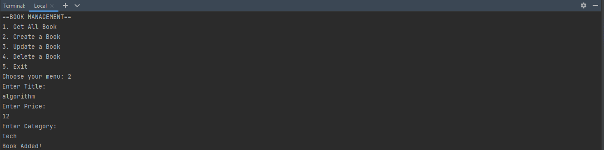
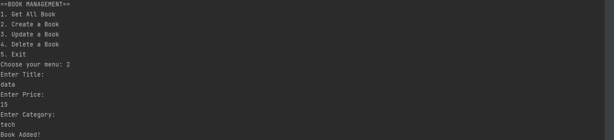
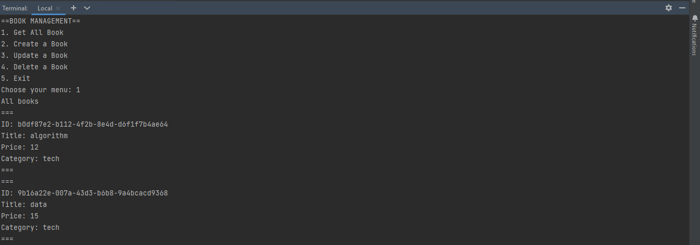
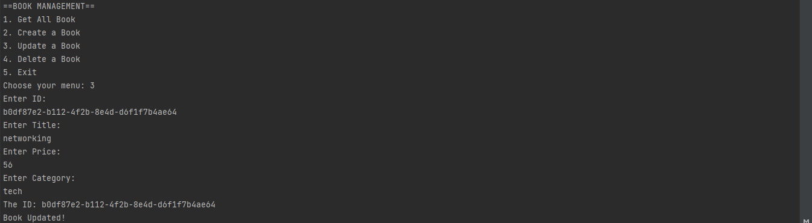
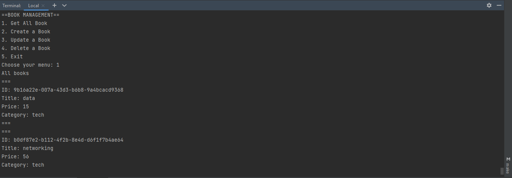
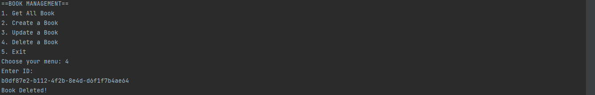
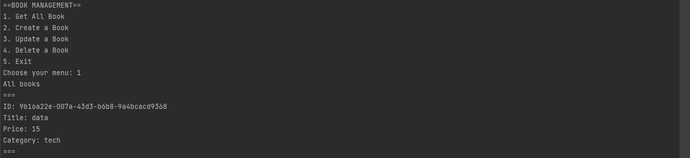
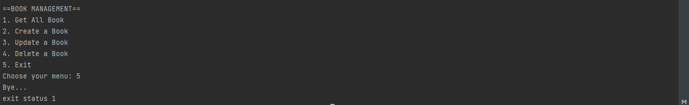

# Weekly Task
## Problem 1
Sebuah Aplikasi yanng digunakan untuk mengelola data buku, yaitu 
id, judul, harga, dan kategori. Pada apliaksi ini menggunakan CRUD
(Create, Read, Update, and Delete).

### Create Book 

### Get All Bookks

### Update Book

Get All After Update:

### Delete Book 

Get All After Delete:

### Exit

